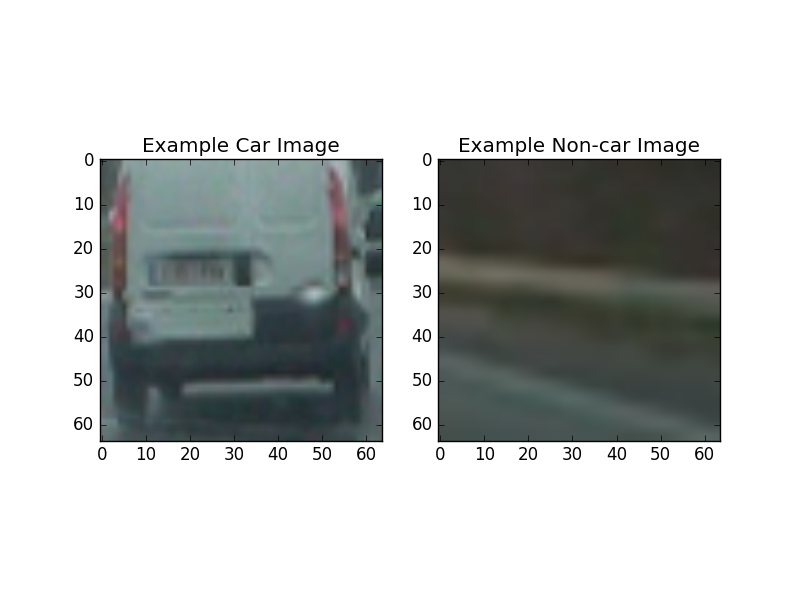
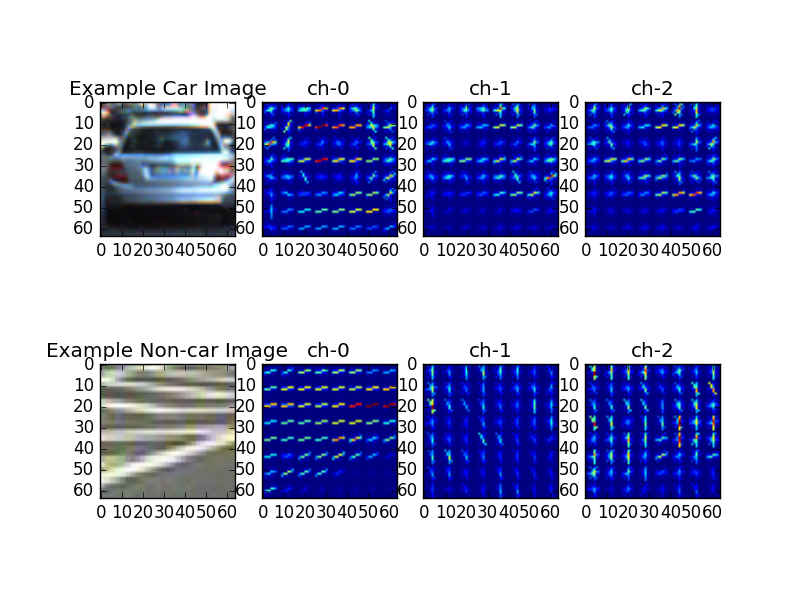
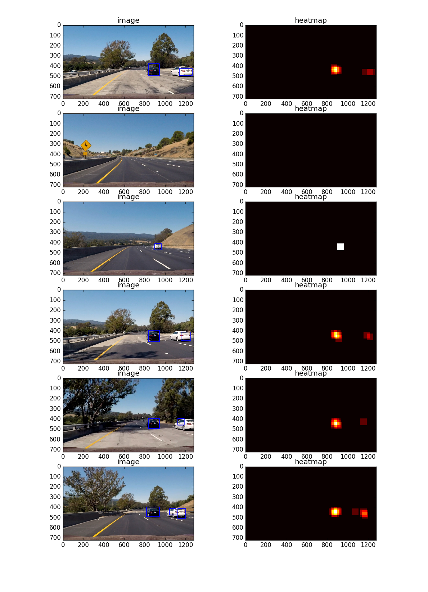
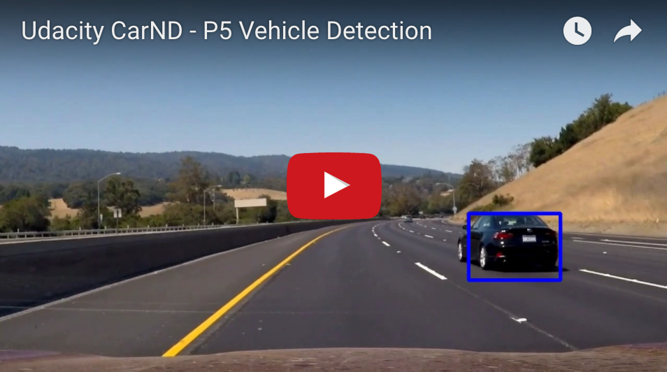

##Vehicle Detection Project

The goals / steps of this project are the following:

* Perform a Histogram of Oriented Gradients (HOG) feature extraction on a labeled training set of images and train a classifier Linear SVM classifier
* Apply a color transform and append binned color features, as well as histograms of color, to your HOG feature vector. 
* Normalize the features and randomize a selection for training and testing.
* Implement a sliding-window technique and use the trained classifier to search for vehicles in images.
* Run the pipeline on a video stream (start with the test\_video.mp4 and later implement on full project\_video.mp4) and create a heat map of recurring detections frame by frame to reject outliers and follow detected vehicles.
* Estimate a bounding box for vehicles detected.


##Overview
This is yet another super fun project and our goal is to identify cars on the road.  Human can do this easily but how does a self-driving car do it?  

In this project we take the traditional machine vision approach by first studying two set of example images.  One set of these images contains some photos of cars on the road and the other set contains photos of taken of the road/highway without the presence of any car.  

We then use computer vision techniques to construct two sets of features that can be thought of as the "DNA" of the car images and the "DNA" of noncar images.  We then train a SVM classifer to be able to predict whether a new image is a car or is not a car based on how closely the "DNA" of the said new image resembles that of an image of the car or otherwise.

Then we use a sliding window approach to search through the video taken by the on-board camera to identify which section of the image/video matches best with the "DNA" of the car image.

Those parts that are identified as cars are drawn as a rectangle in the image/video.  

##Implementation Details
We first read in all the `vehicle` and `non-vehicle` images.  These training images come from a combination of the GTI vehicle image database, the KITTI vision benchmark suite, and examples extracted from the project video itself.  

Here are two example images: a car image and a non-car image:



Here are some statistics of these example images:

* Number of car images:  8792
* Shape of one car image: (64, 64, 3)
* Number of noncar images:  8968
* Shape of one noncar image: (64, 64, 3)

The code for this step is contained in the `retrieve_labeled_data()` function of `car_detection.py`.

###Histogram of Oriented Gradients (HOG)
---
#####Rubric #1.1 Explain how (and identify where in your code) you extracted HOG features from the training images. 

---
We use the `hog()` function from `skimage.feature` to extract the HOG features from the training images. HOG stands for Histogram of Oriented Gradients and is a feature descriptor that keeps tracks of gradient orientation on a grid of cells in an image. It is best to conceptualize this by viewing some example images:  

Here are two randomly selected images from our training collection and their HOG features in the three channels of the YCrCb space:



---
#####Rubric #1.2 Explain how you settled on your final choice of HOG parameters.

---

The parameters used to compute HOG are:

* colorspace=YCrCb : possible values are RGB, HSV, LUV, HLS, YUV, and YCrCb
* orientations=9 : Number of orientation bins
* pixels\_per\_cell=8 : Size (in pixels) of a cell.
* cells\_per\_block=2 : Number of cells in each block.

I have decided to go with this set of values based on the results of the experiments with the goal of getting the highest accuracy for SVM prediction in the lecture/quiz `get_hog_features()`.

```
1.95 Seconds to extract HOG features...
Using: 9 orientations 8 pixels per cell and 2 cells per block in color space  YCrCb  hog channel  1
Feature vector length: 1764
0.04 Seconds to train SVC...
Test Accuracy of SVC =  0.985
My SVC predicts:  [ 1.  1.  0.  0.  0.  0.  1.  0.  1.  1.]
For these 10 labels:  [ 1.  1.  0.  0.  0.  0.  1.  0.  1.  1.]
0.00114 Seconds to predict 10 labels with SVC
```

The parameters used for this section can be found in `TrainingParameters` class in the `training_parameters.py` file.

The code for this step is contained in the `get_hog_features()` method of `DetectionTraining` class in the `detection_training.py` file.

---
#####Rubric 2. Describe how (and identify where in your code) you trained a classifier using your selected HOG features (and color features if you used them).

---

In addition to HOG features, we use two other techniques to create the "DNA" of the image:

* `bin_spatial()`: Spatial binning of color is a technique that combines a cluster of pixels into a single pixel, it essentially down-sampls the image.  We use `cv2.resize()` to achieve this.

The code for this section can be found in the `bin_spatial()` method of the `DetectionTraining` class in `detection_training.py` file.

* `color_hist()`: Color histogram is a representation of the distribution of colors in an image. 

The code for this section can be found in `color_hist()` method of the `DetectionTraining` class in `detection_training.py` file.

The final feature for each image is extracted from spatial binning, color historgram and HOG.  The sub-features from each step are stacked to form the final feature - the "DNA" of the image.  This section of the code can be found in `extract_features()` method of `DetectionTraining` class.

Once we have the "DNA"s for the cars and noncars images, we use `sklearn.preprocessing.StandardScalar()` to normalize the feature values of car and noncar images.  We shuffle the the car and noncar features and split the data into training/test set in the ratio of 90/10. We then use `LinearSVC()` (Linear Support Vector Classification, a variation of SVM with parameter kernel=’linear’ and implemented in terms of liblinear rather than libsvm) to train our classifier.

The code for this section can be found in `train_classifier()` function in `car_detection.py`.

###Sliding Window Search

---
#####Rubric 1.1 Describe how (and identify where in your code) you implemented a sliding window search. 

---
We had originally extracted the feature of each individual window on the road image; however, we found that to be too time-consuming, especially when processing the HOG function.

Instead of extracting HOG features from individual windows independently, we extract the HOG feature out of the entire image once and sub-sampling the perspective area of the array to get the HOG features for each window part.

The code for this section can be found in `find_cars()` function in `car_detection.py`

We use a scale variable to search different window sizes.  Rather than sliding different windows through the image, we scale the image and use the same size of sliding window.


---
#####Rubic 1.2 How did you decide what scales to search and how much to overlap windows?

---

We experiement with different values and settle on the current values of window size as 96px and 50% of overlapping.  A smaller window works better when the car is further ahead (appears smaller) and a larger window works better when the car is near (appears larger).  Size 96px seems to work better than both 64px and 128px.  


---
#####Rubic 2 Show some examples of test images to demonstrate how your pipeline is working. How did you optimize the performance of your classifier?

---
Here are some images that demonstrate the result of the process image function.  The right side of the images are heatmaps and will be discussed in the next section.




---

### Video Implementation

---
#####Rubric 1 Provide a link to your final video output.  Your pipeline should perform reasonably well on the entire project video (somewhat wobbly or unstable bounding boxes are ok as long as you are identifying the vehicles most of the time with minimal false positives.)

---

[](https://youtu.be/YxS7di318OY)


---
##### Rubic 2: Describe how (and identify where in your code) you implemented some kind of filter for false positives and some method for combining overlapping bounding boxes.

---

With each positive detection, we add heat to the heat map and extract bounding boxes for overlapping detections. We then used `scipy.ndimage.measurements.label()` to identify individual blobs in the heatmap.  We then assumed each blob corresponded to a vehicle.  We construct bounding boxes to cover the area of each blob detected.  


To minimizing the flickerness of the resulting blue boxes, we have decide to add the past historical results from the past few frames. Based on experimentation we decide to use `HEATMAP_HISTORY_SIZE=15`.  

In order to remove false postives, we apply `apply_threshold` in `SlidingWindowSearch` class to remove any transient results that are larger than 5.  

---

###Discussion

####1. Briefly discuss any problems / issues you faced in your implementation of this project.  Where will your pipeline likely fail?  What could you do to make it more robust?

The pipeline is heavily dependent on the training set.  However, I wonder, if it will be able to detect non-conventional vehicles that are not made out of metal.  For example if a car camouflage as a ... tree or a house, etc.  I think perhaps we should figure out how to detect moving objects vs non-moving objects?

For some reason, the detection on the white car is far less robust than on the black cars.  I wonder what is the reason.  We had to identify white lanes in the previous projects and we use color filter to extract out the white color part.  I wonder if this has anything to do with the number of white cars in the database.  It might be interesting to take a closer look at the color histogram and see how white compares with black.   